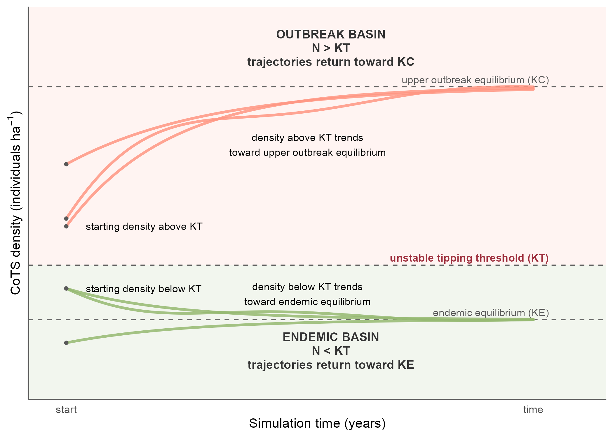

# CoTS Bifurcation Modelling

Simulation and bifurcation modelling of crown-of-thorns starfish (CoTS) outbreak dynamics on Koh Tao reefs, Thailand.

This repository uses local CoTS density observations, benthic substrate data, and sea temperature data to explore how CoTS populations may move between low-density and high-density states under different ecological threshold assumptions. The workflow is designed as a simulation framework rather than a fitted predictive model.

The core modelling aim is to test how alternative assumptions about endemic density, tipping thresholds, carrying capacity, coral cover, and temperature-dependent growth affect simulated CoTS trajectories across Koh Tao reef sites.

## Conceptual model

The conceptual figure below summarises the bifurcation framework used in the simulation model. CoTS density trajectories are simulated relative to a low-density endemic equilibrium, an unstable tipping threshold, and an upper outbreak equilibrium.



## Repository Structure

| File / Folder | Description |
| --- | --- |
| `00_SETUP.R` | Loads packages, sets paths, defines output folders, and establishes shared settings used across the workflow. |
| `01_CLEAN.R` | Cleans and standardises CoTS observations, survey-level CoTS densities, substrate data, coral cover summaries, and temperature data. |
| `02_EXPLORE.R` | Produces exploratory summaries and checks for CoTS density, coral cover, SST, and threshold assumptions. |
| `03_SIM.R` | Runs the main Monte Carlo bifurcation simulation model and saves simulation outputs, trajectory data, diagnostics, and figures. |
| `05_CONCEPTUAL-FIG.R` | Produces a schematic figure explaining the conceptual bifurcation pathways used in the simulation framework. |
| `99_scratch.R` | Scratch/testing script for temporary checks and development code. Not part of the final workflow. |
| `data/raw/` | Raw input datasets, including CoTS observations, CPCe substrate classifications, and Copernicus temperature files. Not tracked on GitHub. |
| `data/processed/` | Cleaned intermediate datasets generated by the workflow. |
| `Analysis_YYYY.MM.DD/` | Dated analysis output folders containing figures, tables, and model objects from each workflow run. |
| `README.md` | Project overview and workflow documentation. |
| `.gitignore` | Defines which local files and generated outputs are excluded from Git tracking. |
| `cots-bifurcation.Rproj` | RStudio project file. |

## Current Folder Structure

```text
cots-bifurcation/
├── 00_SETUP.R
├── 01_CLEAN.R
├── 02_EXPLORE.R
├── 03_SIM.R
├── 05_CONCEPTUAL-FIG.R
├── 99_scratch.R
├── data/
│   ├── raw/
│   └── processed/
├── Analysis_YYYY.MM.DD/
│   ├── figures/
│   ├── tables/
│   └── model_objects/
├── README.md
├── .gitignore
└── cots-bifurcation.Rproj
```

## Data Inputs

The workflow uses three main data streams:

- CoTS monitoring data
  - individual CoTS observations
  - survey IDs, dates, sites, depths, sizes, and removal status
  - survey-level CoTS density calculated as CoTS per hectare

- Benthic substrate data
  - CPCe point classifications from reef photo quadrats
  - hard coral, turf algae, macroalgae, other biotic, abiotic, and unknown substrate categories
  - transect-level and site-level coral cover summaries

- Ocean temperature data
  - Copernicus MULTIOBS sea temperature product: https://doi.org/10.48670/moi-00052
  - Copernicus ANALYSISFORECAST ocean temperature product: https://doi.org/10.48670/moi-00016
  - near-surface temperature is extracted and standardised as `temp_c`
  - temperature source is retained as `temp_source`

## Workflow Summary

### 00_SETUP.R

Sets up the analysis environment.

- loads required packages
- defines paths for raw data, processed data, figures, tables, and model objects
- creates dated analysis output folders
- stores shared palettes, site ordering, and common objects used across scripts

### 01_CLEAN.R

Cleans and prepares the input datasets.

- standardises site names and site codes
- parses survey dates
- converts CoTS observations into survey-level density estimates
- calculates CoTS density using `area_ha = 0.2`
- cleans substrate and growth-form codes
- creates point-level, transect-level, and wide-format substrate tables
- derives hard coral cover for use in KT/KC scenario calculations
- extracts and combines near-surface temperature data from Copernicus products

### 02_EXPLORE.R

Checks the cleaned data and explores observed patterns.

- summarises CoTS density by site and survey
- checks observed density ranges against proposed threshold values
- summarises hard coral cover by site and transect
- checks temperature ranges and temporal coverage
- produces exploratory plots used to guide simulation settings

### 03_SIM.R

Runs the main simulation model.

The model uses observed site-level starting densities and simulates CoTS density trajectories under uncertainty in ecological state values.

Key structure:

- State 1: low-density endemic equilibrium, `KE`
- State 2: unstable tipping threshold, `KT`
- State 3: upper outbreak equilibrium / carrying capacity, `KC`

Current simulation approach:

- samples `KE` across plausible low-density endemic values
- samples `KT` across plausible tipping threshold values
- derives `KC` using hard coral cover, with `KC = KT / HC_prop`
- applies a buffer so `KC` remains above observed starting density where needed
- uses observed CoTS survey density as starting density, `N0`
- incorporates daily temperature forcing through a temperature-dependent growth term, `r_t`
- simulates density trajectories through time using a cubic bifurcation-style population update
- classifies final outcomes by basin/state
- saves simulation tables, diagnostics, and plots

The core population model follows the structure:

```r
dN_dt <- scale * r_t * (N - KE) * (1 - N / KC) * (N / KT - 1)
```

This allows simulated trajectories to move toward either a low-density endemic state or a higher-density outbreak state depending on starting density, threshold placement, coral cover, carrying capacity, and temperature-dependent growth.

### 05_CONCEPTUAL-FIG.R

Produces a schematic figure that explains the model logic.

The conceptual figure is not the simulation itself. It is used to visualise:

- low-density endemic basin
- unstable tipping threshold
- high-density outbreak basin
- trajectories starting below or above the tipping threshold
- how simulated populations may move toward different equilibria

## Output Structure

Each analysis run writes outputs to a dated folder:

```text
Analysis_YYYY.MM.DD/
├── figures/
├── tables/
└── model_objects/
```

Common outputs include:

- cleaned data summaries
- threshold and scenario tables
- Monte Carlo simulation results
- sampled individual trajectories
- final outcome summaries
- bifurcation diagnostics
- conceptual and simulation figures

Large generated tables are treated as local analysis outputs and may not be tracked on GitHub.

## Dependencies

Install required R packages:

```r
install.packages(c(
  "dplyr",
  "tidyr",
  "ggplot2",
  "readr",
  "readxl",
  "stringr",
  "purrr",
  "tibble",
  "lubridate",
  "here",
  "terra",
  "janitor",
  "scales"
))
```

Additional packages may be required as the workflow develops.

## Quick Start

Open `cots-bifurcation.Rproj` in RStudio.

Run scripts in order:

```r
source("00_SETUP.R")
source("01_CLEAN.R")
source("02_EXPLORE.R")
source("03_SIM.R")
source("05_CONCEPTUAL-FIG.R")
```

`99_scratch.R` is for temporary development only and does not need to be sourced for the main workflow.

## Model Interpretation

This project is a simulation-based exploration of possible CoTS outbreak dynamics on Koh Tao reefs. It is not intended to estimate a single fixed outbreak threshold or produce a formal forecast.

Instead, the model evaluates how different plausible ecological assumptions affect whether observed CoTS densities are simulated to return toward a low-density state or move toward a higher-density outbreak state.

The most important model assumptions are:

- the value used for low-density endemic equilibrium, `KE`
- the tipping threshold, `KT`
- the derivation of carrying capacity, `KC`
- site/transect hard coral cover
- observed starting density, `N0`
- temperature-dependent growth, `r_t`

## Notes

Designed for use with Global Reef CoTS monitoring, benthic substrate, and temperature data from Koh Tao, Thailand.

© 2026 Global Reef
Maintainer: Scarlett R. Taylor

## License 
This project is private and not licensed for redistribution. For collaboration inquiries, please contact scarlett@global-reef.com.
